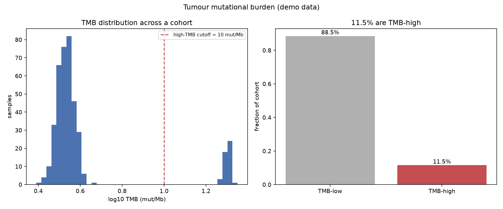

# Tumour Mutational Burden

How many mutations does a tumour carry, and does that predict whether immunotherapy will work? Tumour mutational burden (TMB) turns a whole cancer genome into a single number that has become one of the most-used biomarkers in immuno-oncology.

## Why This Matters

More mutations mean more potential neoantigens — abnormal proteins the immune system can recognise — so high-TMB tumours are more likely to respond to checkpoint inhibitors. TMB is defined as mutations per megabase of sequenced DNA, which makes it comparable across gene panels of different sizes. A cohort's TMB distribution is highly skewed: most tumours are modest, but a tail of hypermutators (often mismatch-repair or POLE-deficient) sits far to the right, and a cutoff around 10 mut/Mb is widely used to flag likely responders.

## How It Works

1. Count somatic mutations per sample and divide by the panel size in megabases.
2. Plot the (log-scaled) TMB distribution across the cohort.
3. Apply a high-TMB threshold and report the responder-eligible fraction.

## What the Demo Shows



The demo simulates a cohort with a hypermutator tail. The TMB histogram is right-skewed, and the cutoff at 10 mut/Mb separates the TMB-high fraction — exactly the read-out used to stratify patients for immunotherapy.

## Run It

```bash
pip install -r requirements.txt
python demo.py
```

> Demonstrated on synthetic data, so it's fully reproducible with no external downloads.
